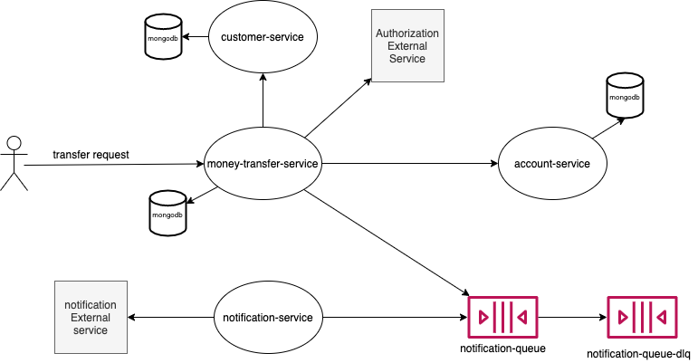

# transfer-app
Service responsible to transfer money between accounts

## Architecture

## Sequence
Request is made to the orchestration service **money-transfer-service** 
1. Records the transaction with **PENDING** status;
2. Get customers informations from **account-service**;
3. Checks if the accounts are active;
4. Checks if the transaction beteween customers is valid(*USER* TO *USER* or *USER* to *SHOP KEEPER*);
5. Calls the **Autorization Service XPTO**;
6. Effective the transaction in **account-service**;
7. Update transaction with **OK** status;
8. Push the transaction information to the **notification-queue**;
10. [notification-service](http://google.com) pulls message from the **notification-queue** an sends to **Notification External Service**

## Aplication Design 

